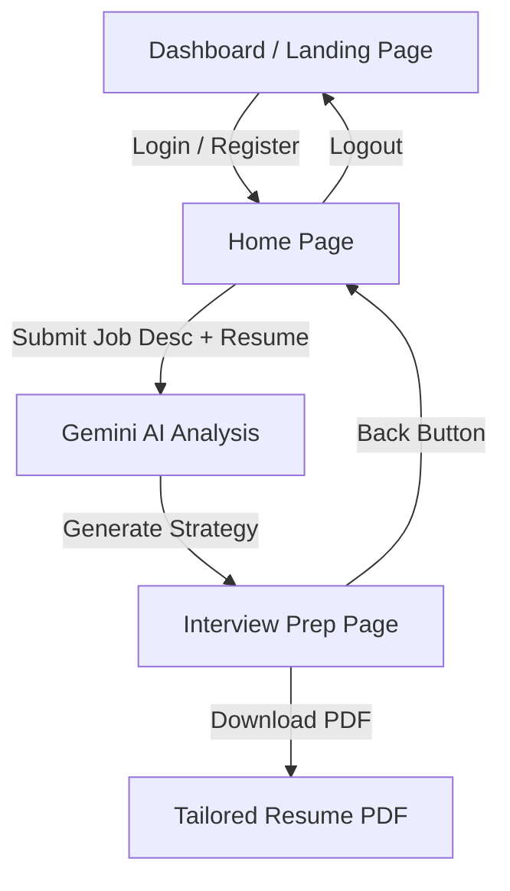
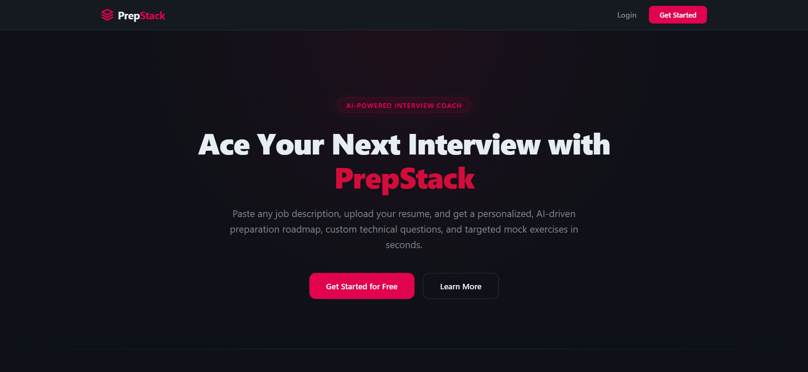
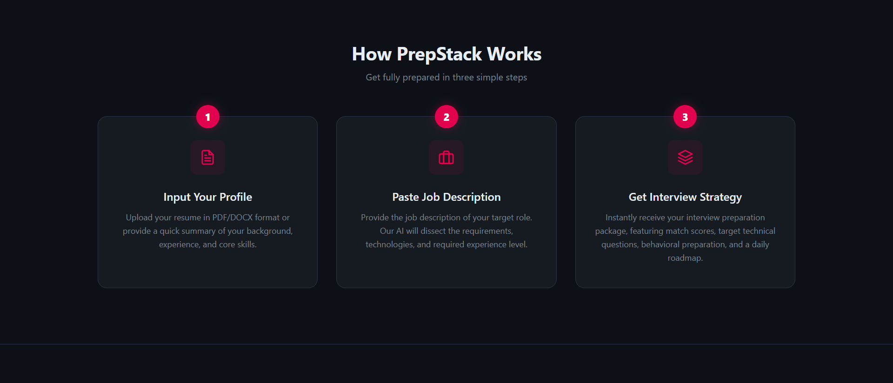
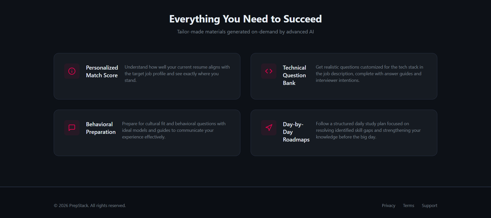
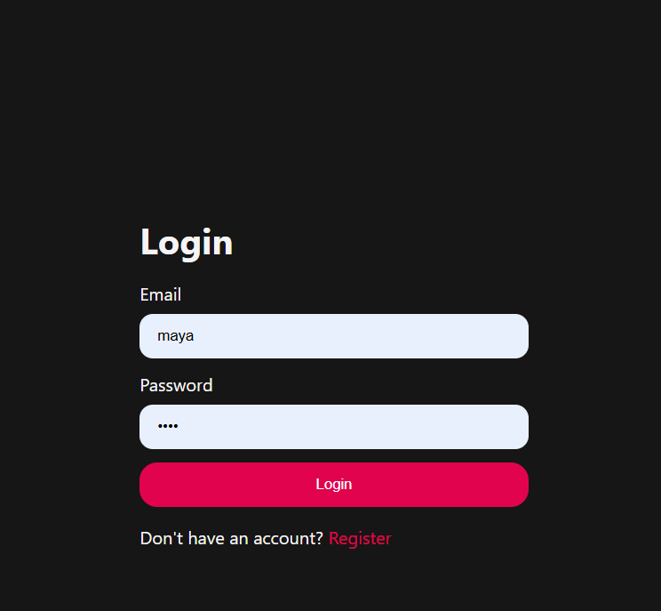
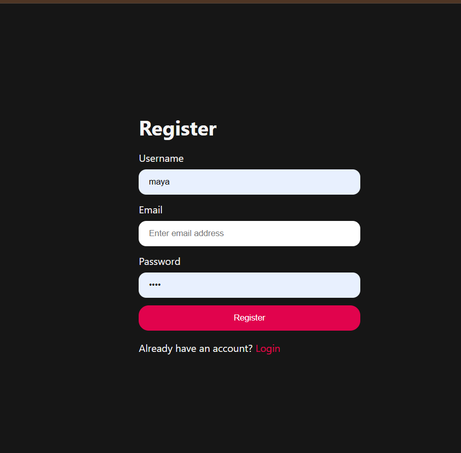
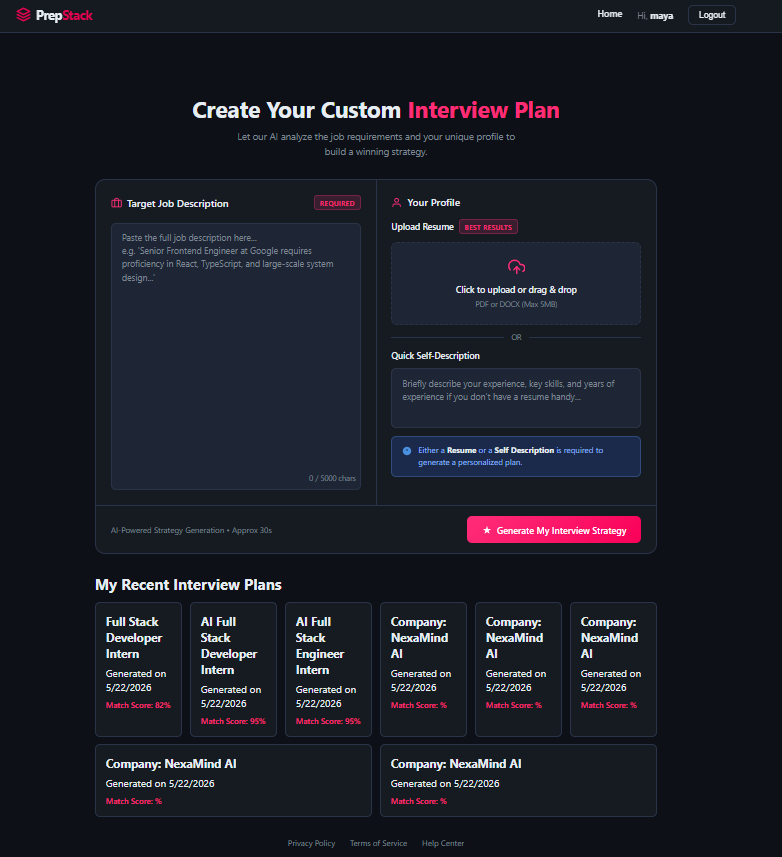
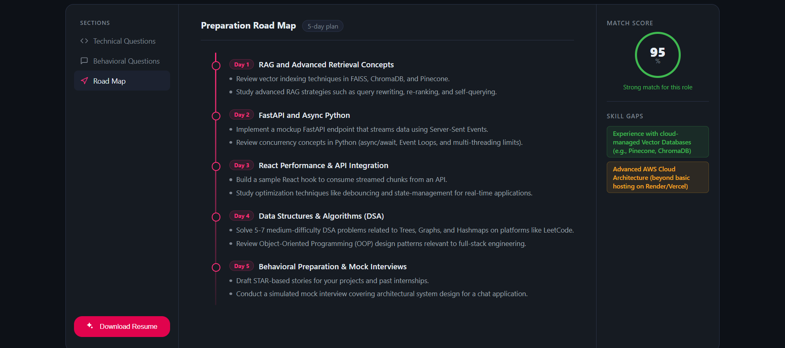
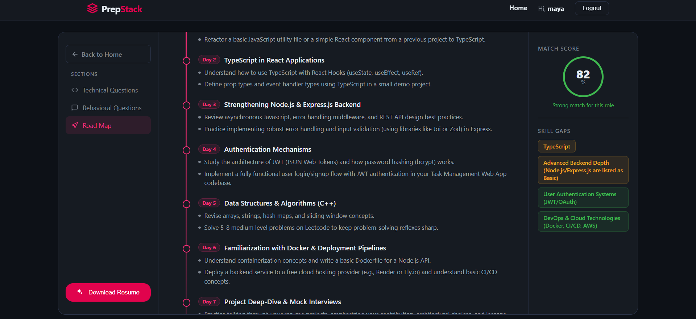
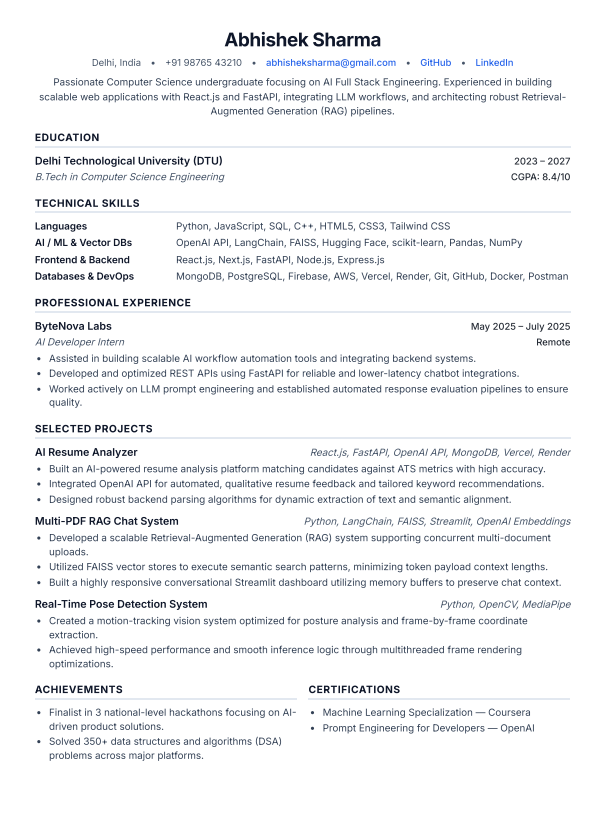

# PrepStack

### *AI-Powered Interview Coach and Preparation Roadmap Generator*

PrepStack is a full-stack web application designed to help candidates prepare for interviews by dissecting job descriptions, parsing resumes or self-profiles, and generating tailored roadmap strategies. Powered by Gemini AI, it generates custom technical and behavioral question banks, a day-by-day study roadmap, and even compiles a tailored resume PDF.

---
## Live Website
---
https://prep-stack-frontend-nu.vercel.app/
---
## Demo Video

[Watch Video Demo](https://drive.google.com/file/d/1zbyldCIlPvoRdAVBsfrjWAzmUAaWUAH9/view?usp=sharing)

## Key Features

*   **AI-Powered Profiling**: Upload your resume (PDF/DOCX) or write a quick self-profile description.
*   **Job-to-Resume Matching**: Paste any target job description to get a personalized match score.
*   **Target Question Banks**: Instantly receive specific technical and behavioral questions generated for the stack, complete with answer guides and interviewer intent.
*   **Day-by-Day Study Roadmaps**: A step-by-step preparation plan mapping out exactly what to study every day leading up to the interview.
*   **Tailored Resume Generation**: Download a customized resume customized specifically for the target job profile.
*   **Secure Authentication**: Integrated JWT-based user authentication (cookies, secure sessions, persistence).

---

##  Technology Stack

| Component | Technology | Description |
| :--- | :--- | :--- |
| **Frontend** | React, React Router v7, Sass (SCSS) | Responsive, modern dark UI with glassmorphism effects. |
| **Backend** | Node.js, Express, Mongoose | RESTful API, cookie-based auth session management. |
| **Database** | MongoDB | Storing user accounts, profile details, and generated strategies. |
| **AI Integration** | Google Gemini AI (`@google/genai`) | Intelligent analysis, matching, roadmap and Q&A generation. |
| **Resume Compiler**| Puppeteer & PDF-Parse | Extracts text from uploaded files and renders printable tailored PDFs. |

---

##  User Workflow



1.  **Dashboard (Landing Page - `/`)**: Explore PrepStack's features. Guest users can log in or register.
2.  **Home Page (`/home`)**: Logged-in workspace. Paste the job description, upload your resume or write a profile summary, and view past interview plans.
3.  **Interview Page (`/interview/:id`)**: The Q&A and roadmap interface. Read through questions, reveal model answers, see skill gaps, download your tailored resume, or return back to the Home page using the navigation options.

---
## Live Website 
### Main Dashboard
---







---

### Register/Login
---





---

### Home Page
---



---

### Interview Page (Example)
---





---
### Tailored Resume (Example)
---


##  Setup & Installation

### Prerequisites
- Node.js (v18+)
- MongoDB (Running locally or a MongoDB Atlas URI)
- Gemini API Key

---

### Step 1: Clone the Repository
```bash
git clone https://github.com/ShrishtiSingh26/PrepStack.git
cd PrepStack
```

---

### Step 2: Backend Configuration
1. Navigate to the backend directory:
   ```bash
   cd Backend
   ```
2. Install dependencies:
   ```bash
   npm install
   ```
3. Create a `.env` file in the `Backend` root directory with the following keys:
   ```env
   PORT=3000
   MONGO_URI=your_mongodb_connection_string
   JWT_SECRET=your_jwt_secret_key
   GEMINI_API_KEY=your_google_gemini_api_key
   ```
4. Run the backend server in development mode:
   ```bash
   npm run dev
   ```
   *The backend will run at `http://localhost:3000`.*

---

### Step 3: Frontend Configuration
1. Open a new terminal and navigate to the frontend directory:
   ```bash
   cd Frontend
   ```
2. Install dependencies:
   ```bash
   npm install
   ```
3. Run the development build:
   ```bash
   npm run dev
   ```
   *The frontend will start at `http://localhost:5173`.*

---


